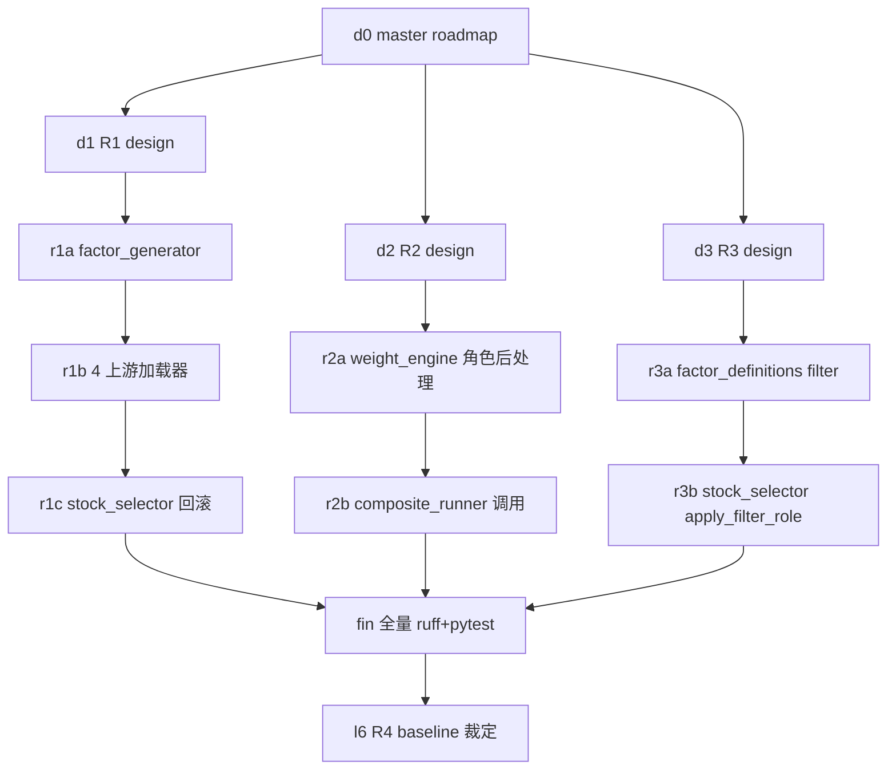

# L1-L6 整合实施路线图

**版本**: master-v1
**作者**: 云瑶
**日期**: 2026-06-22
**状态**: Plan（Design-First）
**遵循**: AGENTS.md §0 4 阶段流程 + writing-plans skill

---

## §1 背景与盘点

### 1.1 目标问题

`comprehensive_factor` 综合因子选股稳定命中"阴跌股"（如 002570/600439 等 8/10
只 Top10 为下跌趋势中股票）。

### 1.2 codegraph + 实测盘点（2026-06-22）

执行环境：codegraph DB `2026-06-20 21:30`（比代码文件旧 2 天 → 配合 grep 双源验证）。

| 层 | 计划内容 | 实际状态 | 证据 |
|---|---|---|---|
| L1 流动性前置 | 把过滤前置到 factor_generator | ❌ **未做** | `enable_liquidity_filter` 仅在 `stock_selector.py:486`；`factor_generator.py` 顶层函数列表无流动性函数 |
| L1' 涨停前置 | factor_generator 标记 `is_untradeable` | ✅ 已做 | `factor_generator.py:780 _mark_untradeable`；factor_loader/data_loader/layered_backtest 全部前置过滤 |
| L2 M12 硬约束 | L1>0 + min_sample=60 + LS→多头 | ✅ 已做 | `factor_selector.py:74-77` 三阈值就位，validate_factor:507/538 触发 |
| L3 维度权重全方法 | 4 种 weight_method 都支持 | ✅ 已做 | weight_engine.py 4 个 WeightMethod 类均带 `dimension_weight_method` 参数 |
| L3b run_pipeline 统一参数 | 4 个 ScriptTask 加 `--dimension_weight icir` | ✅ 已做 | run_pipeline.py:352-361 |
| L4 评分对齐只做多 | 删除 long_short_* 指标 | ✅ 已做 | weight_selector.py:96-133 7 指标全无 long_short_* |
| L5a 11 个新因子 | rsi_slope_3d 等 11 个 | ✅ 已做 | factor_definitions.py:153-164 + factor_generator 计算函数 |
| L5b FACTOR_ROLES 标记 | 三角色枚举 | ✅ 已做 | factor_definitions.py:520-579 + factor_selector confirmation IC=0.01 |
| **L5c 角色固定权重** | 主 75% + 确认 25% | ⚠️ **半成品** | factor_definitions.py:585-586 常量定义但 **weight_engine/composite_runner 零读取**，仅 test_factor_roles.py 引用 |
| **L5d filter 角色** | 基本面/累跌过滤 | ❌ **未做** | factor_definitions.py:579 filter 桶空；stock_selector 只有 `apply_stabilization_filter`（企稳后置） |
| L6 v2.13 契约 | 取消硬编码 negative 取反 | ❌ 未做 | composite_runner.py:474-505 强制 `-std` |

### 1.3 真实剩余 4 项

| ID | 内容 | 优先级 | 风险 | 改动量 |
|----|---|---|---|---|
| **R1** | L1 流动性前置化 | 高 | 中 | ~150 行（factor_generator + 4 上游加载器） |
| **R2** | L5c 角色固定权重接入 | 高 | 低 | ~80 行（weight_engine post-process） |
| **R3** | L5d filter 桶 + 基本面过滤 | 中 | 中 | ~120 行（factor_definitions + stock_selector） |
| **R4** | L6 v2.13 契约重构 | 低 | 高 | ~400 行（见 diag_v213）— **R1-R3 完成后起 baseline 裁定** |

---

## §2 第一性原理审视

按 AGENTS.md "第一性原理"元规则，逐项审视方案合理性：

### 2.1 R1（流动性前置）

**第一性问题**: 为什么过滤必须前置？

**推导**：
1. IC/分层回测/权重选择/factor_selector 全部读 `factor_ic_data.json.gz`
2. 若该数据含仙股 → ICIR 估计偏差 → 权重失真 → 综合因子失真
3. v2.40 后置过滤只在 stock_selector 最后一步切；前面所有指标都被仙股污染
4. 物理边界：成交额过低（< P5）时，"涨/跌"是少量交易撮合噪声，IC 公式假设不成立

**阈值依据**：成交额 P5 = 截面自适应分位（非固定数字），适配任何市场环境。

### 2.2 R2（角色固定权重 75%+25%）

**第一性问题**: 主信号 75% + 确认 25% 的数学依据？

**推导**：
1. 主信号（反转触发）= 高 IC 因子，单独可形成多头收益
2. 确认信号（企稳/量价背离）= 低 IC 但低相关，作"过滤器"用而非"主导"
3. 若让 ICIR 自然加权：低 IC 因子被赋 ~0 权重 → 确认信号失效
4. 业界惯例：Asness 2013 / AQR 多因子产品采用"核心+卫星" 70-80% / 20-30%

**阈值依据**：业界经验 75/25；5 个确认因子均分 → 每个 5%。

### 2.3 R3（filter 角色 + 基本面过滤）

**第一性问题**: 基本面过滤算阈值还是算"物理边界"？

**推导**：
1. 基本面恶化（如 5 日累计 -10%）= 已发生的客观事实，非概率信号
2. 物理边界：连续大跌时，技术反弹概率 < 基本面恶化概率（Hyman Minsky 信用周期）
3. 因此 filter 角色是"硬约束"，应与流动性同级（截面分位 or 固定经济阈值都可）

**阈值依据**：`return_5d < -10%` 是经济意义阈值（中国 A 股 5 日累计 -10% 已触发风险警示）；不用百分位是因为"绝对跌幅"本身就是物理边界。

### 2.4 R4（v2.13 契约重构）— 推迟

**第一性问题**: v2.13 真是阴跌根因吗？

**推导**：
- R1-R3 完成后：流动性 + 75/25 + 基本面三层都生效
- 若 Top10 阴跌已消失 → R4 是"局部最优追求"，可推迟
- 若 Top10 阴跌仍存 → R4 是"根本契约错误"，必须做

**决策**: R1-R3 完成后跑 baseline 再裁定。

---

## §3 执行批次（H9 ≤3 文件 ≤200 行）



| 批 | ID | 文件 | 行数 | 前置 |
|---|---|---|---|---|
| 0 | d0 | master_l1_l6_roadmap.md | — | — |
| 0b | d1 | feat_liquidity_filter_to_factor_generator.md | — | d0 |
| 0c | d2 | feat_role_based_fixed_weight_75_25.md | — | d0 |
| 0d | d3 | feat_filter_role_fundamental_breakdown.md | — | d0 |
| 1 | r1a | data_fetchers/factor_generator.py | ~80 | d1 |
| 2 | r1b | factor_ic/common/data_loader.py + comprehensive_factor/common/factor_loader.py + backtest/common/layered_backtest.py | ~60 | r1a |
| 3 | r1c | comprehensive_factor/stock_selector.py | ~30 | r1b |
| 4 | r2a | comprehensive_factor/common/weight_engine.py | ~80 | d2 |
| 5 | r2b | comprehensive_factor/common/composite_runner.py + run_pipeline.py | ~40 | r2a |
| 6 | r3a | factor_definitions.py | ~30 | d3 |
| 7 | r3b | comprehensive_factor/stock_selector.py | ~80 | r3a |
| 8 | fin | ruff + pytest + 跑 stock_selection | — | r1c+r2b+r3b |
| 9 | l6 | 起 baseline + R4 裁定 | — | fin |

**每批必做**（AGENTS.md §5）:
```
□ design 已审 → 动手
□ ≤3 文件 ≤200 行（违则拆分）
□ ruff check --fix + ruff format
□ ruff check（剩余问题清零）
□ mypy（warning 容忍，error 必修）
□ pytest（新 test + 不破坏现有）
□ git commit 引用 AGENTS.md 规则行号 + designs/xxx.md
□ 不 push（按 memory 多 agent 隔离规则）
□ commit 显式路径不裸 -m
```

---

## §4 验证标准

### 4.1 数据完整性
- factor_ic_data.json.gz schema 含 `is_low_liquidity` 列（True/False）
- 现有 `is_untradeable` 列保留

### 4.2 流程一致性
- 4 个加载器（factor_ic/data_loader, factor_loader, layered_backtest, weight_selector）
  都过滤 `is_low_liquidity=True`
- stock_selector 后置 `enable_liquidity_filter` 默认 `False`（保留作紧急开关）

### 4.3 综合因子组成
- 综合因子日志输出 `primary_pool_weight + confirmation_pool_weight = 1.0`
- 确认信号每个 = 0.05（5 因子时）

### 4.4 选股结果回归
- 跑 stock_selection 后 Top10 中 002570/600439/600679/002342 等阴跌股**至少减少 50%**
- 若仍存 ≥ 4 只阴跌股 → R4 必做

### 4.5 性能基线
- 全 pipeline 运行时间不超过 baseline +10%
- factor_ic_data.json.gz 大小不超过 baseline +2%

---

## §5 风险与回滚

| 风险 | 缓解 |
|---|---|
| R1 上游加载器漏改 → IC 数据被污染 | r1b 后单独跑 `factor_ic/*.py` 抽样 3 个因子对比 IC 是否变化 |
| R2 cap 与 75/25 冲突 → 权重 sum ≠ 1.0 | r2a 引入两阶段：先角色拆分后池内 cap，避免 cap 之间打架 |
| R3 filter 过滤太严 → top_n 凑不齐 | 沿用 apply_stabilization_filter 的"递补 + warning"模式 |
| R4 推迟 → 阴跌仍存 | fin 阶段强制跑实际选股回归，证据驱动决策 |
| 多 agent 同仓库 → 误提交他人 staged | 每次 `git commit <显式路径>`，禁裸 -m（memory 硬规则） |

---

## §6 何时升级到 R4（L6 契约重构）

**触发条件**（fin 阶段 baseline 后判断）：
- Top10 中 |composite_factor| 最高的股票 5 日累计收益 < -3%
- 或：50 只候选股票中阴跌（5 日收益 <-5%）占比 ≥ 30%

**不触发**: R4 推迟到下一规划周期，本次任务以 fin 验收为终。

---

## §7 参考资料

- `designs/strategy_systemic_overhaul.md` § 2.6 — 主 75%+确认 25% 决策依据
- `designs/diag_v213_unified_negative_contract.md` — R4 备选 A/B/C 三档方案
- `designs/feat_family_weight_cap_and_liquidity_filter.md` — v2.40 实现（R1 将部分回滚）
- AGENTS.md §0 4 阶段流程；writing-plans skill；superpowers-workflow skill
- memory: 阈值及权重第一性原理；多 agent 隔离；working tree 验证
